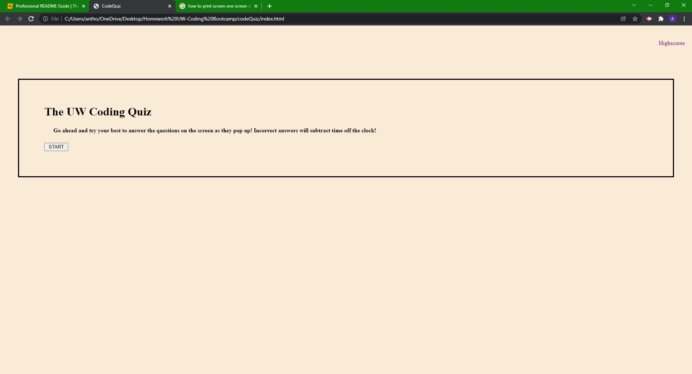
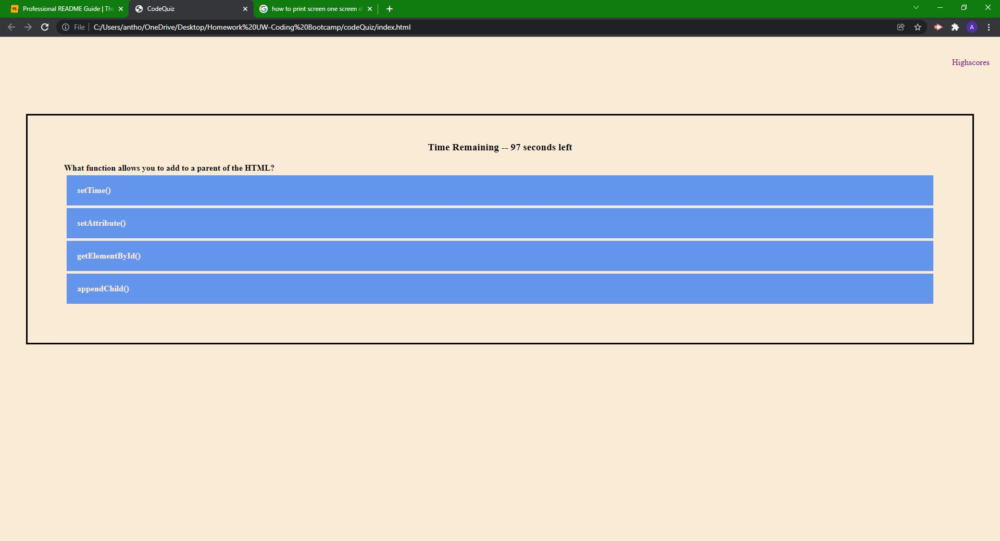
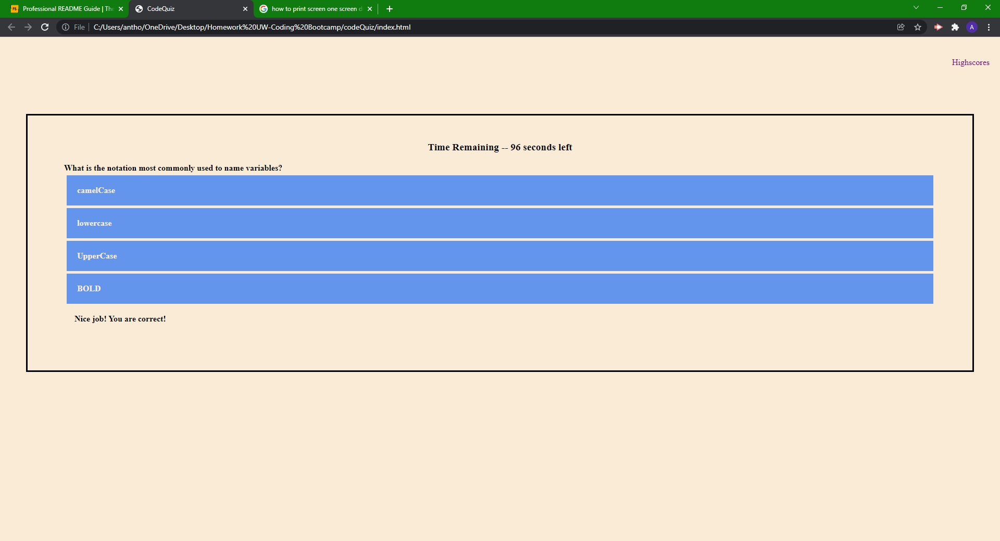
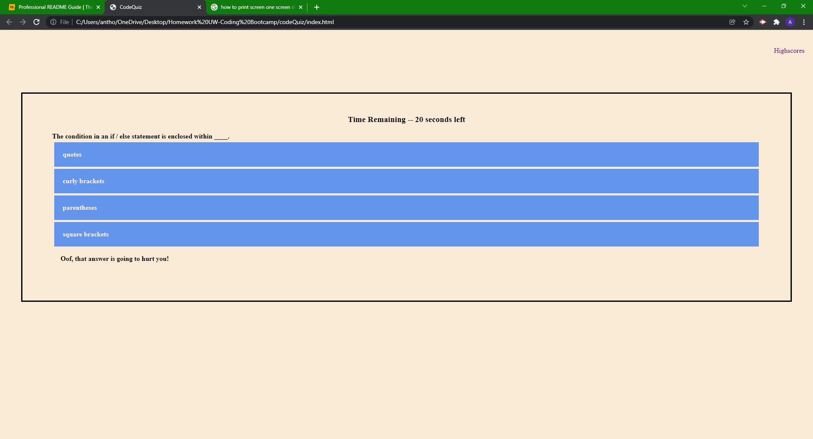
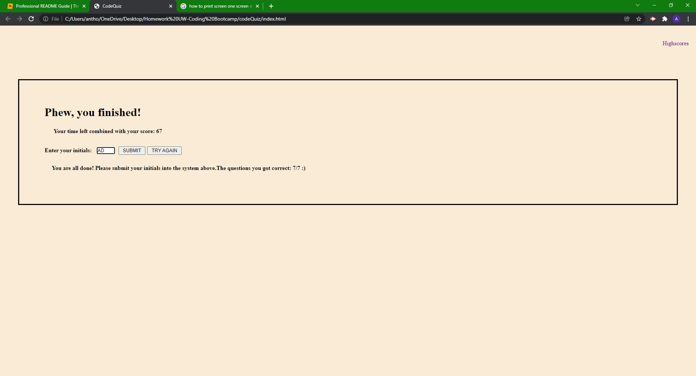
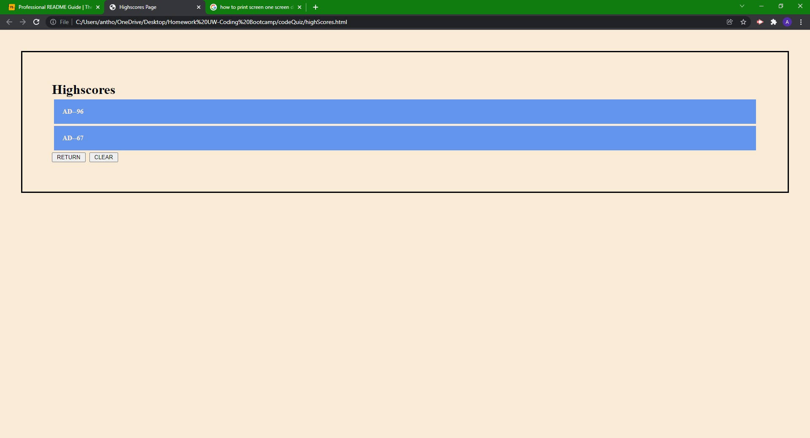

# codeQuiz

## Description

This app is a code quiz built primarily in JavaScript to showcase some skills I have learned.  
This was built to develop my skills by building functions within JavaScript and 
to practice my skills at problem solving to build working code. 

## Learned

- Linking all my pages together to build a working website
- Targeting variables within the realm of scope
- Creating a timer that has functionality built within the quiz itself
- Saving to local storage
- Pulling data from local storage

## Table of Contents

- [Description](#description)
- [Learned](#learned)
- [Usage](#usage)
- [Credits](#credits)

## Usage

This quiz is developed to have a start button that deploys a timer and creates quiz questions that move from one to the next as they are answered.

The timer will continue as normal or lose time if a question is incorrect.

When the quiz is finished, the user can store their initials in local storage or try again.

After storing initials, the user can view their and any other scores stored in the system. They can also clear the highscores or return to the start of the quiz.

## Credits

Deployed website can be found at: https://aditore.github.io/codeQuiz 
 
Code by: [aditore](https://github.com/aditore)